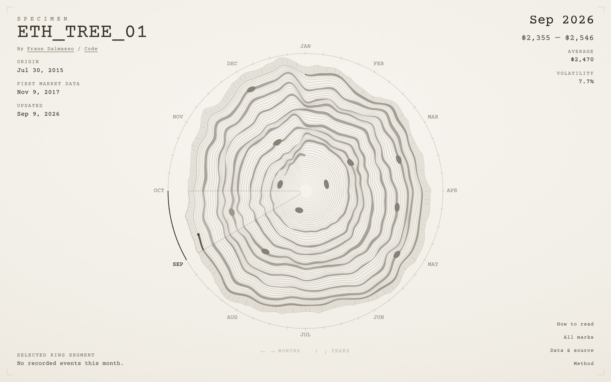

# Ethereum Annual Rings

Ethereum's market history, read the way a dendrochronologist reads a tree. Every ring is one year of ETH/USD trading: the price draws the ring's shape, the volume sets its weight, and the protocol's milestones sit in the grain as knots.

**Live:** https://0xfrann.github.io/ethereum-tree-seams/

[](https://0xfrann.github.io/ethereum-tree-seams/)

## Reading the specimen

- **Angle** is calendar time. A year starts at twelve o'clock and runs clockwise.
- **Ring shape** is the price: four close samples per month, log-transformed within the year, so each ring shows its own year's rhythm rather than absolute dollars.
- **Ring weight** is the average daily USD volume, normalised across the whole period.
- **Knots** are Ethereum protocol milestones, from Frontier at the centre to the latest upgrade.
- **The outer edge** is the unfinished present. The current year stays visibly open.

The chronology starts at genesis on 30 July 2015. The single-market price series starts on 9 November 2017, so the two earlier years are drawn as unpriced grain rather than stitched together from other exchanges. Selecting any month or knot shows the exact figures and the source behind them.

## How it is built

| Layer | Choice |
| --- | --- |
| Framework | Next.js 16 (App Router, static export), React 19, TypeScript |
| Rendering | A high-DPI `<canvas>` for the plate, semantic HTML for the readout and controls |
| Data | One build-time fetch of the Bitstamp ETH/USD daily CSV from CryptoDataDownload, aggregated into a single JSON document |
| Hosting | GitHub Pages, rebuilt daily by GitHub Actions |
| Tests | `node:test`, no framework |

There is no server. `scripts/fetch-market-data.mjs` runs before every build, validates and aggregates the upstream file, and writes `public/market-data.json`. The page preloads that file and draws from it, so a visitor's request never reaches the data provider. The deploy workflow runs on a schedule; if the upstream fetch fails, the build fails and the previously published site stays up with its last good data.

The renderer caps the device-pixel ratio, caches the static artwork, and redraws only the selection layer during interaction. The entrance is choreographed on one clock and honours reduced-motion preferences.

## Accessibility

Everything on the plate can be reached without a pointer. Left and right arrows move through months, up and down move through years, and Home and End jump within a year. Knots are also listed as ordinary buttons, the readout is live-announced, the canvas has a text alternative, and focus is always visible.

## Run it locally

Requires Node.js 22.13 or newer and pnpm.

```bash
pnpm install
pnpm dev
```

The first run fetches the market data once. Refresh it at any time with:

```bash
pnpm run data
```

Other scripts:

```bash
pnpm run build       # static export to out/
pnpm run start       # serve out/ locally
pnpm run test:unit   # unit tests, no build needed
pnpm run test:all    # lint, typecheck, build, and every test
```

## Deploying

The `Deploy` workflow publishes `out/` to GitHub Pages on every push to `main`, on a daily schedule, and on demand. Enable Pages with the "GitHub Actions" source in the repository settings and it works as is. For a custom domain or a user site, set `BASE_PATH` to an empty string in the workflow. The same export deploys unchanged to Vercel or any static host.

## Project structure

```text
app/
  layout.tsx                     Metadata, self-hosted type, data preload
  page.tsx                       The single page
  components/EthRings.tsx        Explorer state, keyboard and pointer input, readout, dialogs
  components/eth-rings/
    renderer.ts                  Canvas geometry and every drawing pass
    event-geometry.ts            Date-to-angle mapping, knot placement, hit regions
    motion.ts                    The entrance score: one timing table for every beat
    Odometer.tsx, TypeOn.tsx     Readout counters and typed-on text
    model.ts, format.ts          Types and number formatting
lib/
  market-data.mjs                CSV parsing, validation, and aggregation
  event-data.mjs                 Sourced milestone records
  source-note.mjs                The note left in the source for whoever reads it
scripts/
  fetch-market-data.mjs          Build-time data fetch, run before every build
  sign-export.mjs                Writes the note above <html> in the export, after every build
docs/
  data-pipeline.md               Fetch, validate, aggregate, publish
  data-decisions.md              What the rings are allowed to say
  market-data-sources.md         The source in use and the alternatives
  protocol-milestones.md         The knots, their sources, and the exclusions
  design-system.md               The sheet: material, type, spacing, layout, motion
  knot-geometry.md               How a milestone becomes a point on the plate
tests/                           Unit tests, plus one suite that checks the static export
```

## Data boundaries

- Market data is CryptoDataDownload's Bitstamp ETH/USD daily file, under its own terms. Coverage starts on 9 November 2017; earlier years are deliberately unpriced.
- The 2017 ring is partial, and so is the current year until it closes.
- Days missing from the upstream file are disclosed in the document's `source.gaps` and never interpolated.
- Milestones are an editorial selection of protocol events with a source, a checked date, and a confidence note each. They are context, not claims about what moved the market.

See [the data decisions](docs/data-decisions.md) and [the data pipeline](docs/data-pipeline.md) for the reasoning.

## Author and license

Made by [Frann Dalmasso](https://www.linkedin.com/in/franndalmasso). Code is released under the [MIT License](LICENSE); the market data stays subject to the provider's terms.
