# Narrative entrance and accessible flow

**Status:** Wave 2 implementation specification

**Accepted inputs:** `TODO.md` and `docs/research/decision-gate.md`

**Scope:** full-screen entrance, return path, session behavior, responsive composition, focus, motion, semantics, and state tests

## Experience decision

Show the **real annual-ring specimen softly behind the entrance when market data is ready**. Do not hide it entirely and do not display a fabricated placeholder specimen while data is unavailable.

This is the strongest fit for the computational-dendrochronology direction: the visitor sees one continuous specimen plate whose interpretation comes into focus, rather than a literary splash screen followed by an unrelated application. During the entrance, the actual specimen sits at low contrast (`0.12–0.18` visual opacity as a starting range), without selected-month emphasis, labels, hover response, or animation. It is decorative in this state (`aria-hidden="true"`) and the explorer beneath is inert. If data is still loading or has failed, retain the warm paper field and truthful load state beneath the modal; do not invent rings, measurements, or metadata.

Entry changes emphasis rather than replacing the page: the narrative recedes, the same specimen reaches normal contrast, supporting metadata settles at the edges, controls become operable, and the compact encoding key remains visible.

## Final introduction copy

**46 words:**

> Trees keep a record of what they endure. This experiment imagines the ETH market the same way: price shapes each ring, volume gives it weight, protocol milestones form knots, and security incidents leave scars.
>
> The outer ring is unfinished. Each new day can change its shape.

Heading: **A living market archive**

First-session primary action: **Enter the rings →**

Reopened primary action: **Return to the rings**

The heading is not counted in the 46 words. Keep the copy to these two short paragraphs and approximately 40–50 characters per composed line. Do not repeat the encoding key inside the narrative.

## Composition

### Desktop wireframe (`>= 900px`)

```text
┌──────────────────────────── full viewport / paper field ────────────────────────────┐
│ COMPUTATIONAL DENDROCHRONOLOGY                         LIVE MARKET SPECIMEN · ETH/USD│
│ Ethereum Annual Rings                                  source / cutoff (real values)│
│                                                                                     │
│             A living market archive                              [Close introduction]│
│                                                                                     │
│             Trees keep a record of what they endure.                                   │
│             This experiment imagines the ETH market...       (real specimen, faint)│
│                                                                   ╭────────────╮    │
│             The outer ring is unfinished.                       ( annual rings )    │
│             Each new day can change its shape.                    ╰────────────╯    │
│                                                                                     │
│             [ Enter the rings → ]                                                  │
│                                                                                     │
│                                              quiet negative space                    │
└─────────────────────────────────────────────────────────────────────────────────────┘
```

- Put identity at the upper left and real source/freshness metadata at the upper right; both are secondary to the narrative.
- Place the readable block left of center, vertically near the optical middle. Maximum text measure is `50ch`.
- Offset the actual specimen to the right and behind the block. It may pass beneath the overlay field, but no ring edge may reduce text contrast.
- The close control occupies the upper-right safe area and remains visually distinct from source metadata.
- On entry, the specimen may reach normal contrast while the narrative layer dissolves; layout must not jump.

### Mobile wireframe (`< 900px`, including 320 CSS px)

```text
┌────────────── 100dvh, vertically scrollable if needed ──────────────┐
│ ETHEREUM ANNUAL RINGS                         [Close introduction]  │
│ LIVE MARKET SPECIMEN · ETH/USD                                      │
│                                                                     │
│                 (real specimen, faint and cropped)                  │
│                       ╭──────────╮                                  │
│                      (   rings    )                                 │
│                       ╰──────────╯                                  │
│                                                                     │
│ A living market archive                                             │
│                                                                     │
│ Trees keep a record of what they endure. This experiment imagines  │
│ the ETH market the same way…                                        │
│                                                                     │
│ The outer ring is unfinished. Each new day can change its shape.   │
│                                                                     │
│ [                 Enter the rings →                    ]            │
└─────────────────────────────────────────────────────────────────────┘
```

- Use normal document flow, not absolute positioning for the copy and action. The modal content can scroll inside the viewport at high zoom or short landscape heights.
- Crop the real specimen deliberately above/behind the copy; never scale it so small that it becomes ornamental noise. Apply a paper-toned scrim behind text where necessary for contrast.
- Respect `env(safe-area-inset-*)`. The close and primary actions have at least `44 × 44` CSS px targets and at least `8px` separation from other targets.
- The primary action is full-width only at narrow sizes; its label remains text, not an icon.

## State model

Narrative visibility is orthogonal to market loading and explorer selection. Opening or closing the narrative must not remount the explorer, start another fetch, or reset its selection.

```mermaid
stateDiagram-v2
    [*] --> SessionUnknown: SSR and first client render
    SessionUnknown --> IntroFirst: hydrated; marker absent or storage unavailable
    SessionUnknown --> Explorer: hydrated; marker present

    IntroFirst --> Explorer: Enter / Close / Escape\nwrite marker, focus explorer target
    Explorer --> IntroReopened: Read introduction\nsave opener and selection
    IntroReopened --> Explorer: Return / Close / Escape\nkeep marker and selection, restore opener

    IntroFirst --> IntroFirst: market loading / ready / error changes
    IntroReopened --> IntroReopened: market loading / ready / error changes
```



Required UI state:

```text
narrativeMode = "checking-session" | "first-open" | "closed" | "reopened"
marketState    = "loading" | "ready" | "error"
selection     = current year/month/event selection (owned by explorer)
```

Do not encode narrative visibility into `selection` or `marketState`.

## Session and hydration contract

Use one versioned key, for example `ethereum-rings:introduction:v1`, in `window.sessionStorage`.

1. Server rendering and the first client render use the same deterministic `checking-session` shell because the server cannot read `sessionStorage`. This prevents a hydration mismatch and prevents the explorer from flashing interactively before a first-session entrance.
2. The checking shell occupies the viewport with the paper field, has `aria-busy="true"`, and contains no enabled entrance controls until the first layout/effect check completes. It should normally last one frame; avoid an announced “loading introduction” message.
3. In a client layout effect, read the key. Value `dismissed` opens the explorer; a missing key opens the first-session introduction.
4. If storage access throws (privacy policy, sandbox, quota/security error), fail safely to `first-open` for this page load and keep a memory-only dismissed flag thereafter. The application remains usable; do not surface a storage error to the visitor.
5. Activating Enter, Close, or Escape on the first-session introduction writes `dismissed` before closing. Failure to write still closes it for the current page lifetime.
6. The key lasts only for the browser tab/session according to `sessionStorage`; never copy it to cookies or `localStorage`. A new browser session shows the entrance again. Reloading in the same session does not.
7. Reopening never clears or rewrites the key. It is an explicit reading action, not a new first visit.

The entrance must not depend on market data completing. A visitor can enter while data is loading; the explorer then exposes its ordinary loading state. A returning-session visitor moves directly from the short checking shell to that same state.

## Interaction flows

### First-session enter, close, and Escape

- After hydration chooses `first-open`, move focus programmatically to the narrative heading (`tabIndex={-1}`), allowing the copy to be encountered before the controls.
- Tab order inside the modal is: **Close introduction**, then **Enter the rings →** in DOM order appropriate to the visual composition. Shift+Tab wraps from the first control to the last; Tab wraps from the last to the first.
- Enter/Space on either button performs its labelled action. Enter, Close, and Escape all count as dismissal, set the session marker, close the modal, unlock page scrolling, and move focus to the explorer entry target.
- The preferred first-entry focus target is the focusable rings explorer/canvas when ready. If still loading, focus its status container only if programmatically focusable; if an error is present, focus the error heading or alert-adjacent retry region without repeating the alert. If no useful target exists yet, focus the explorer's persistent heading, not `body`.
- Pointer movement, hover, scroll, clicking the decorative specimen, or clicking the backdrop does **not** dismiss the entrance.

### Reopen and return

- A persistent icon button remains available in the entered explorer with accessible name **Read introduction**.
- Activating it saves `document.activeElement` (normally the button), leaves explorer and selection state mounted, changes mode to `reopened`, makes the rest of the page inert, locks background scroll without changing its position, and focuses the narrative heading.
- The reopened modal shows **Return to the rings** rather than “Enter.” Its close button and Escape perform the same return action.
- On every reopened close path, restore focus to the saved opener if it is still connected and focusable. Otherwise focus the current explorer entry target. The accepted default is therefore the persistent Read introduction button.
- Do not replay selection announcements when reopening or closing. Preserve year, month, event, scroll position, cached data, error/retry state, and any expanded readout exactly.

### Persistent button and tooltip

- Use a neutral information glyph consistent with the final icon system; the control remains a semantic `<button type="button">`, never an unlabeled SVG or link.
- Give the button `aria-label="Read introduction"` and a visible text tooltip containing exactly **Read introduction**. Connect the tooltip with `aria-describedby` while it is shown; do not rely on the HTML `title` attribute.
- Show the tooltip on keyboard focus and pointer hover; hide it on blur, pointer exit, Escape, or activation. It must be reachable visually without becoming a separate tab stop and must not obscure current source/freshness information.
- The visible glyph may be `16–18px`, but its target is at least `44 × 44` CSS px. Keep it persistent at 320px width and 200% zoom; allow it to join the normal utility row rather than overlap the specimen.
- While the narrative is open, this underlying button is inert and absent from the accessibility tree; the modal's own close control is the return mechanism.

## Focus, keyboard, and screen-reader semantics

- Render the open entrance as a labelled modal dialog: `role="dialog"`, `aria-modal="true"`, `aria-labelledby` pointing to **A living market archive**, and optionally `aria-describedby` pointing to the two copy paragraphs. Do not use `role="alertdialog"`.
- Give the close control the accessible name **Close introduction**. A visible glyph alone is insufficient.
- Apply the HTML `inert` attribute to all page content outside the open dialog. Use `aria-hidden` only as a compatibility fallback and never place it on an ancestor of the dialog.
- Trap focus only while open. Include both modal buttons, tolerate browser chrome focus transitions, and return focus deterministically. The trap must release even if storage writes or animation callbacks fail.
- Lock background scroll while preserving the previous scroll offset; restore that exact offset on close. The dialog itself may scroll.
- Keep hover/pointer tracing in the underlying explorer silent to assistive technology. Announce only committed selections after entry, through the explorer's existing polite live region. Narrative state changes do not announce the selected month again.
- The canvas is not the only semantic source. After entry, protocol knots and security scars require operable semantic equivalents outside the canvas; their names begin with **Milestone:** or **Scar:**, and scars identify the affected layer without implying an Ethereum protocol compromise.
- The compact entered-state legend is a labelled group/list, not a live region. Required language: **Ring shape — price**, **Ring weight — volume**, **Knots — protocol milestones**, **Scar size — reported incident magnitude**.
- Decorative background rings, texture, Ethereum marks, rules, and registration marks use empty alternative text or `aria-hidden="true"`.

### Entered explorer focus order

Use DOM reading order rather than positive `tabindex` values:

1. skip/navigation and project identity links;
2. Read introduction;
3. rings explorer/canvas or its semantic overview;
4. year controls;
5. month controls;
6. milestone and scar controls in chronological order;
7. selected readout and its source link when applicable;
8. remaining project links.

If the final desktop layout visually reorders these regions, DOM order still follows this sequence. The selected readout itself is not focused automatically when pointer-hover changes; committed keyboard/button selections use the established polite announcement.

## Motion

Default motion is restrained and functional:

- entrance exit: `180–260ms` opacity transition for the narrative field and specimen contrast;
- reopening: `120–180ms` opacity transition;
- no zoom-through-the-rings, radial growth replay, parallax, typewriter effect, or staggered copy reveal;
- focus movement and inert/scroll state change at activation, not after animation completion.

Under `prefers-reduced-motion: reduce`, use an immediate state change or a near-immediate opacity dissolve (`<= 50ms`) with no transform. Never wait for `transitionend` to unlock controls, restore focus, or complete dismissal. If CSS or the Web Animations API is unavailable, the final state still applies synchronously.

## Touch, viewport, and zoom behavior

- Do not disable browser pinch zoom and do not set a restrictive maximum scale.
- Support reflow at 320 CSS px width and browser text zoom to 200%; verify functional use at 400% zoom in a desktop browser viewport.
- At high zoom, metadata and copy become one column, the dialog scrolls, and fixed controls move into flow before they collide. No horizontal scrolling is required to read or operate the entrance.
- Account for `100dvh` and safe-area insets; avoid relying solely on `100vh` on mobile browser chrome.
- Do not add swipe-to-dismiss or backdrop-tap dismissal. Touch scrolling inside an overflowed dialog must not move the inert page beneath it.
- Maintain WCAG contrast for narrative text, controls, tooltip, and focus indicators against the paper/scrim. The faint specimen is never allowed to carry required information or weaken text contrast.

## Loading, error, partial-data, and no-event behavior

The narrative is an explanatory layer, not a data gate:

| Market/event state | While entrance is open | After dismissal | Reopen behavior |
|---|---|---|---|
| Loading | Paper field; no fabricated specimen. Underlying status remains `aria-busy`, but is inert and not announced through the modal. | Show one polite loading status. Focus its stable region if first-entry focus is needed. | Preserve the in-flight request; do not restart it. |
| Ready | Show the real specimen faintly and decoratively; source/cutoff may appear only when real. | Enable explorer and compact legend; latest partial year says **Still growing**. | Preserve selection and show the same real specimen faintly. |
| Provider/cache error | Keep the narrative calm; do not inject the error into the prose or auto-dismiss. | Existing error is announced once with a reachable **Try again** action. | Preserve error and retry state; closing returns to the error region/button. |
| Empty milestone/scar collections | Intro copy still explains the encoding system, not the number of visible events. | Rings remain usable; semantic event region says **No protocol milestones or security scars are available for this view.** No empty controls. | No change and no repeated empty-state announcement. |
| Missing source candle / partial 2017 / partial current year | No detailed caveat inside the poetic copy. | Truthful source/methodology metadata exposes the pre-series boundary, source gap, and partial-year state. | Selection and caveat state remain unchanged. |

A retry or late successful load while the modal is open must not steal focus or announce behind the modal. When the modal closes, expose the latest real state. A late load must not automatically close the introduction.

## Implementation invariants

- Exactly one modal may exist; do not render separate first-visit and About dialogs.
- Exactly one session marker controls automatic display. It does not store explorer selection.
- The explorer stays mounted across reopen/close transitions.
- There is always an explicit close control, a keyboard Escape path, and a persistent reopen path after entry.
- No interaction outside the modal is operable or perceivable to assistive technology while it is open.
- The introduction contains no fabricated market metadata, full legend, event list, or causal claim.
- The entrance can be dismissed and reopened even when storage, market fetch, animation, or the canvas is unavailable.

## Test contract

### Session and hydration

1. SSR markup and the first client render both produce `checking-session`; hydration emits no mismatch warning.
2. Missing session key opens the modal once; Enter writes `dismissed`, closes it, and a same-tab reload does not reopen it.
3. Existing `dismissed` key bypasses the modal after the checking shell.
4. A new browser session (empty session storage) opens it again.
5. Simulated `sessionStorage.getItem` and `setItem` exceptions still allow one in-memory dismissal and full explorer use.
6. Reopening and closing does not delete/change the marker or issue another market-data request.

### Keyboard and focus

7. First open focuses the dialog heading; Tab/Shift+Tab remain inside Close and Enter/Return controls.
8. Enter/Space activates each button; Escape closes from the heading and from every control.
9. Backdrop click, pointer move, hover, and scroll do not dismiss.
10. First dismissal focuses the ready explorer target; loading and error variants focus their specified stable regions.
11. Reopen saves the icon button as opener; Return, Close, and Escape each restore focus to it.
12. Removing or disabling the opener before close uses the current explorer target fallback without throwing.
13. Background links, canvas, controls, and live regions are inert/hidden from the accessibility tree while open and restored after close.
14. Scroll position is unchanged after reopen/close; the focus trap and scroll lock release if animation is disabled or interrupted.

### State preservation and announcements

15. Select a historical year/month and event, reopen, then close through each path; selection, expanded readout, and source link are unchanged.
16. Pointer hover behind/opening the narrative creates no live announcement; a committed post-entry selection announces once.
17. A market request resolving or failing while open neither moves focus nor produces a behind-modal announcement; the resulting ready/error state appears after close.
18. Retry state survives reopen; reopening does not refetch. Activating Try again after return makes exactly the normal single retry.
19. Empty event collections render the explicit no-events text and no phantom event controls.

### Semantics, responsive layout, and motion

20. Accessibility-tree inspection finds one modal dialog with correct name/description, Close and primary-action buttons, and no exposed decorative specimen.
21. The persistent icon has the accessible name and visible tooltip **Read introduction**; the tooltip appears on focus/hover, is not tabbable, and does not rely on `title`.
22. Automated and manual checks confirm at least `44 × 44` CSS px touch targets and visible focus indicators.
23. At desktop, tablet, 320px mobile, short landscape, 200% text zoom, and 400% browser zoom, all copy/actions remain reachable without horizontal reading scroll or collision.
24. Touch/pinch zoom remains enabled; dialog scrolling does not scroll the background.
25. With reduced motion, no transforms or delayed focus/state changes occur and dismissal completes without `transitionend`.
26. With ordinary motion, transitions stay within the specified durations, do not shift layout, and never replay the specimen's data growth.
27. Contrast checks pass for text, buttons, tooltip, focus rings, and metadata with the real faint specimen at its maximum allowed entrance opacity.
28. Loading, ready, provider error, no-event, partial-2017, missing-candle, and current-partial-year screenshots are reviewed on desktop and mobile.

## Resolved and deferred decisions

Resolved here:

- The real specimen is softly visible behind the entrance only when ready; it is not hidden after load and never fabricated before load.
- The introduction is a modal explanatory layer with one implementation for first display and reopening.
- All first-session dismissal paths set the session marker; reopening preserves selection and returns focus to the persistent button.
- The initial SSR/hydration state is a deterministic, briefly inert checking shell.
- Reduced motion changes immediately without transforms.

Deferred to the visual-system integration gate:

- Exact neutral information glyph, paper/scrim values, focus-ring token, and specimen opacity within the specified accessible bounds.
- Exact responsive breakpoint if Agent D's layout system chooses a nearby token instead of `900px`.
- Exact explorer entry element, provided it follows the ready/loading/error focus fallbacks above.
